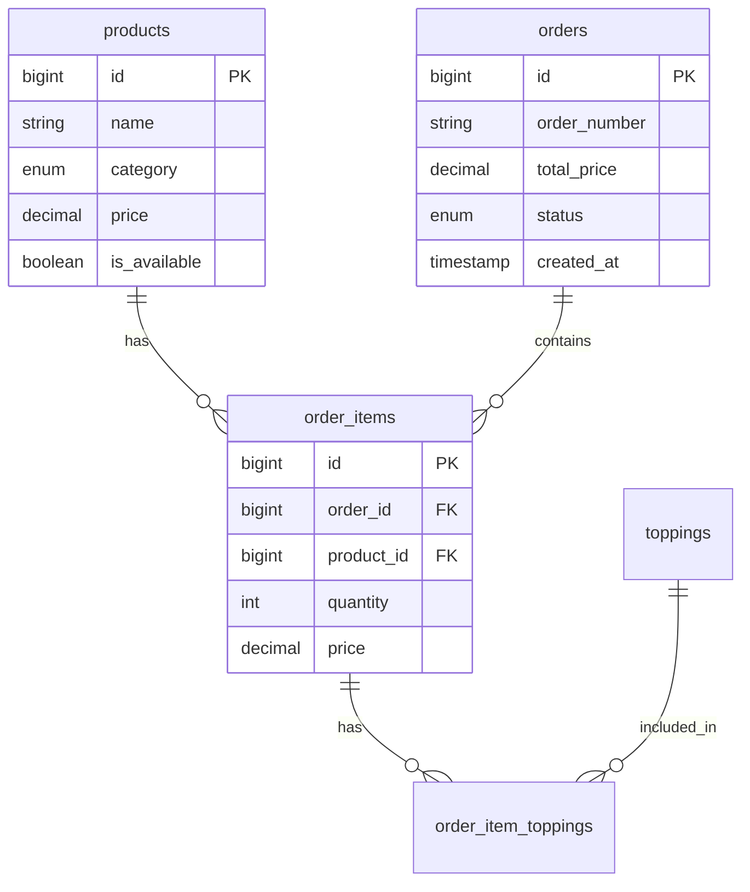

# 🍽️ Laravel POS - Kantin Pintar SMK

## 📋 Deskripsi Project
Aplikasi Point of Sale (POS) modern untuk kantin sekolah dengan fitur self-service ordering menggunakan tablet dan real-time kitchen display system. Dirancang untuk mempercepat proses pemesanan dan meningkatkan efisiensi operasional kantin sekolah.

## ✨ Fitur Utama

### Untuk Pelanggan (Tablet Kasir)
- ✅ **Self-service ordering** - pesan sendiri tanpa kasir
- 🍽️ **Kategori produk** (Makanan & Minuman)
- ✨ **Custom topping** untuk setiap produk
- 🛒 **Shopping cart** real-time
- 🎫 **Generate nomor antrian** otomatis
- 📱 **Touch-friendly interface** untuk tablet
- ⏱️ **Auto-reset** setelah idle

### Untuk Staff Dapur
- 👨🍳 **Real-time kitchen display system**
- 🔔 **Notifikasi pesanan baru** (visual & audio)
- 📊 **Status tracking**: New → Processing → Done
- 🎯 **Filter pesanan** by status
- ⏰ **Elapsed time indicator**
- 🔄 **Auto-refresh** setiap 3 detik
- ✅ **One-click status update**

### Fitur Teknis
- 📦 Database relasional (MySQL)
- 🔄 AJAX-based real-time updates
- 📱 Responsive design (mobile-first)
- 🎨 Modern UI dengan Bootstrap 5
- 🚀 Optimized performance
- 🔒 Input validation & error handling

## 🛠️ Tech Stack

**Backend:**
- 
- 
- 

**Frontend:**
- 
- 
- 

**Tools:**
- Composer (PHP dependency manager)
- NPM (optional, for asset compilation)

## 📸 Screenshots

### Landing Page
*(Screenshot placeholder - Halaman utama dengan hero section)*

### Tablet Kasir Interface
*(Screenshot placeholder - Interface pemesanan self-service)*

### Kitchen Display System
*(Screenshot placeholder - Display pesanan untuk dapur)*

## 🚀 Instalasi

### Prerequisites
Pastikan sistem Anda sudah terinstall:
- PHP >= 8.1
- Composer
- MySQL >= 8.0
- Node.js & NPM (optional)
- Web server (Apache/Nginx) atau gunakan Laravel built-in server

### Langkah-langkah Instalasi

#### 1. Clone Repository
```bash
git clone https://github.com/username/laravel-pos.git
cd laravel-pos
```

#### 2. Install Dependencies
```bash
composer install
```

#### 3. Environment Configuration
```bash
# Copy file environment
cp .env.example .env

# Generate application key
php artisan key:generate
```

#### 4. Database Configuration
Edit file `.env` dan sesuaikan konfigurasi database:
```env
DB_CONNECTION=mysql
DB_HOST=127.0.0.1
DB_PORT=3306
DB_DATABASE=laravel_pos
DB_USERNAME=root
DB_PASSWORD=
```

Buat database baru:
```bash
# Via MySQL CLI
mysql -u root -p
CREATE DATABASE laravel_pos;
EXIT;
```

#### 5. Run Migration & Seeder
```bash
# Jalankan migration untuk membuat tabel
php artisan migrate

# Jalankan seeder untuk data awal (produk & topping)
php artisan db:seed

# Atau jalankan keduanya sekaligus:
php artisan migrate:fresh --seed
```

#### 6. Storage Link (Optional)
```bash
php artisan storage:link
```

#### 7. Start Development Server
```bash
php artisan serve
```

Aplikasi dapat diakses di: `http://localhost:8000`

## 📱 Cara Penggunaan

### Akses Halaman

| URL | Deskripsi |
|-----|-----------|
| `/` | Landing page (informasi kantin) |
| `/kasir` | Interface tablet kasir untuk pelanggan |
| `/dapur` | Kitchen display untuk staff dapur |

### Flow Pemesanan (Customer Journey)

1. **Pilih Menu**
   - Akses `/kasir` di tablet
   - Pilih kategori: Makanan atau Minuman
   - Browse produk yang tersedia

2. **Customize Order**
   - Klik produk yang diinginkan
   - Modal topping akan muncul
   - Pilih topping (optional)
   - Atur quantity
   - Lihat subtotal otomatis

3. **Keranjang**
   - Klik icon keranjang (floating button)
   - Review pesanan
   - Edit quantity atau hapus item
   - Lihat total harga

4. **Checkout**
   - Klik "Pesan Sekarang"
   - Sistem generate nomor antrian
   - Pesanan otomatis terkirim ke dapur
   - Catat nomor antrian Anda

5. **Auto-Reset**
   - Interface akan reset otomatis setelah 30 detik idle
   - Siap untuk pelanggan berikutnya

### Flow Dapur (Kitchen Workflow)

1. **Terima Pesanan**
   - Monitor menampilkan pesanan baru (background merah)
   - Notifikasi audio berbunyi
   - Lihat detail: nomor, items, topping, waktu

2. **Proses Pesanan**
   - Klik tombol "Proses"
   - Status berubah (background kuning)
   - Mulai menyiapkan pesanan

3. **Selesaikan Pesanan**
   - Klik tombol "Selesai"
   - Status berubah (background hijau)
   - Card pesanan otomatis hilang setelah 2 menit
   - Kasir panggil nomor antrian

## 🗃️ Database Schema

### ERD (Entity Relationship Diagram)


### Tabel Utama

**products**
- Menyimpan data produk makanan dan minuman
- Fields: `id`, `name`, `category`, `price`, `image`, `description`, `is_available`

**toppings**
- Menyimpan data topping yang bisa ditambahkan
- Fields: `id`, `name`, `price`, `category`, `is_available`

**orders**
- Menyimpan header pesanan pelanggan
- Fields: `id`, `order_number`, `total_price`, `status`, `timestamps`

**order_items**
- Detail item per pesanan (relasi many-to-many dengan products)
- Fields: `id`, `order_id`, `product_id`, `quantity`, `price`

**order_item_toppings**
- Pivot table untuk relasi items dengan toppings
- Fields: `id`, `order_item_id`, `topping_id`, `price`

## 🔌 API Endpoints

### Kasir Endpoints

**GET /api/products**
- Mengambil daftar produk
- Query param: `?category=makanan` atau `?category=minuman`
- Response: Array of products (JSON)

**GET /api/toppings**
- Mengambil daftar topping
- Response: Object grouped by category (JSON)

**POST /api/orders**
- Membuat pesanan baru
- Body: `{items: [{product_id, quantity, toppings: []}]}`
- Response: Order number & total price

### Dapur Endpoints

**GET /api/orders/pending**
- Mengambil pesanan dengan status 'new' atau 'processing'
- Response: Array of orders dengan detail items (JSON)

**PATCH /api/orders/{id}/status**
- Update status pesanan
- Body: `{status: 'new' | 'processing' | 'done'}`
- Response: Updated order data

## 📁 Struktur Project
```
laravel-pos/
│
├── app/
│   ├── Http/
│   │   ├── Controllers/
│   │   │   ├── HomeController.php
│   │   │   ├── KasirController.php
│   │   │   └── DapurController.php
│   │   └── Requests/
│   │       ├── StoreOrderRequest.php
│   │       └── UpdateOrderStatusRequest.php
│   │
│   └── Models/
│       ├── Product.php
│       ├── Topping.php
│       ├── Order.php
│       ├── OrderItem.php
│       └── OrderItemTopping.php
│
├── database/
│   ├── migrations/
│   │   ├── ..._create_products_table.php
│   │   ├── ..._create_toppings_table.php
│   │   ├── ..._create_orders_table.php
│   │   └── ...
│   │
│   └── seeders/
│       ├── DatabaseSeeder.php
│       ├── ProductSeeder.php
│       └── ToppingSeeder.php
│
├── public/
│   ├── css/
│   │   └── style.css          # Custom CSS
│   ├── js/
│   │   ├── kasir.js           # Kasir tablet logic
│   │   └── dapur.js           # Kitchen display logic
│   └── sounds/
│       └── notification.mp3   # Alert sound
│
├── resources/
│   └── views/
│       ├── layouts/
│       │   └── app.blade.php  # Master layout
│       ├── home.blade.php     # Landing page
│       ├── kasir/
│       │   └── index.blade.php
│       └── dapur/
│           └── index.blade.php
│
└── routes/
    └── web.php                # Route definitions
```

## 🎨 Customization

### Menambah Produk Baru

Edit `database/seeders/ProductSeeder.php`:
```php
Product::create([
    'name' => 'Produk Baru',
    'category' => 'makanan', // atau 'minuman'
    'price' => 20000,
    'image' => 'url-image',
    'description' => 'Deskripsi produk',
    'is_available' => true
]);
```

Jalankan ulang seeder:
```bash
php artisan db:seed --class=ProductSeeder
```

### Mengubah Warna Tema

Edit CSS variables di `public/css/style.css`:
```css
:root {
    --primary-color: #FF6B35;    /* Orange */
    --secondary-color: #004E89;  /* Blue */
    --success-color: #06D6A0;    /* Green */
    /* ... customize colors ... */
}
```

### Mengubah Polling Interval

Edit `public/js/dapur.js`:
```javascript
// Default: 3000ms (3 detik)
const app = {
    // ...
    pollingRate: 3000,
    // ...
};
```

## 🐛 Troubleshooting

### Problem: Error 500 saat submit order
**Solution:**
- Check database connection di `.env`
- Check logs: `storage/logs/laravel.log`
- Pastikan migration sudah dijalankan
- Verify foreign key constraints

### Problem: Pesanan tidak muncul di dapur
**Solution:**
- Check browser console untuk JavaScript errors
- Verify polling sedang berjalan (lihat network tab)
- Check database: `SELECT * FROM orders WHERE status != 'done'`
- Clear browser cache

### Problem: Asset (CSS/JS) tidak load
**Solution:**
- Check `APP_URL` di `.env`
- Pastikan path asset benar
- Jalankan `php artisan storage:link`
- Clear cache: `php artisan cache:clear`

## 🔒 Security Considerations

### Production Checklist
- [ ] Set `APP_DEBUG=false` di `.env`
- [ ] Generate strong `APP_KEY`
- [ ] Use HTTPS (SSL certificate)
- [ ] Set proper file permissions
- [ ] Restrict database user privileges
- [ ] Regular database backups

## 🔮 Future Improvements

- [ ] **Admin Dashboard**: CRUD products & sales reporting
- [ ] **Payment Integration**: Cash/QRIS
- [ ] **Multi-language**: ID/EN support
- [ ] **PWA**: Offline capability

## 🤝 Contributing

Contributions are welcome! Please follow these steps:
1. Fork the repository
2. Create your feature branch
3. Commit your changes
4. Push to the branch
5. Open a Pull Request

## 📄 License

This project is licensed under the MIT License - see the [LICENSE](LICENSE) file for details.

## 👨💻 Author

**Kantin Pintar Team**
- Project: POS Kantin SMK

---

**Made with ❤️ and ☕ for SMK Nusantara**
